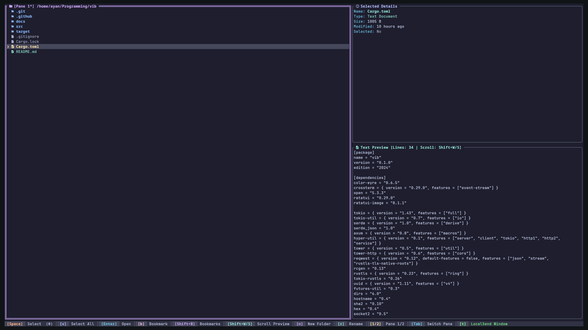
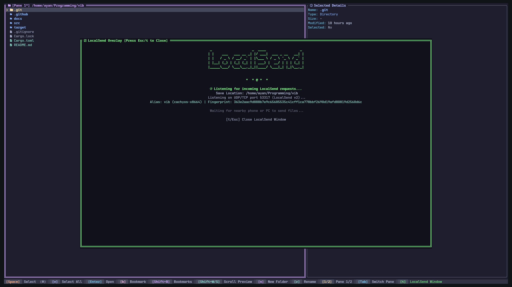

# vib

[](https://ratatui.rs/)


A terminal file browser with LocalSend built in. Manage, organize, and move files around your machine, then send or receive them across your devices without leaving the terminal.





---

## Features

- Dual-pane browsing with independent tab navigation
- Native LocalSend integration for local network file transfers
- File operations: cut, copy, paste, create folders, and rename
- Multi-select tagging for batch operations and file transfers
- Persistent directory bookmarks
- Built-in text file preview with line scrolling
- Transfer status indicators, confirmation prompts, and progress banners
- Catppuccin-themed terminal UI

---

## Keyboard Shortcuts

### Navigation & Dual Pane

| Key | Action |
|---|---|
| `Up` / `Down` / `k` / `j` | Navigate active pane |
| `Enter` / `l` / `Right` | Open directory |
| `Backspace` / `h` / `Left` / `Esc` | Go to parent directory |
| `Tab` | Switch active pane |
| `1` / `2` | Switch to Pane 1 or Pane 2 |
| `w` | Close secondary pane |

### File Operations

| Key | Action |
|---|---|
| `Space` | Select / deselect highlighted item |
| `v` | Select / deselect all items in directory |
| `c` | Copy selected item(s) |
| `x` | Cut selected item(s) |
| `p` | Paste clipboard contents |
| `n` | Create new folder |
| `r` / `F2` | Rename file or folder |

### Text Preview Pane

| Key | Action |
|---|---|
| `Ctrl+d` / `Shift+S` / `PageDown` | Scroll preview down |
| `Ctrl+u` / `Shift+W` / `PageUp` | Scroll preview up |

### Directory Bookmarks

| Key | Action |
|---|---|
| `b` | Bookmark current directory |
| `B` / `m` / `Ctrl+b` | Open Bookmarks menu |
| `d` / `Delete` | Remove bookmark (inside menu) |

### LocalSend & File Transfer

| Key | Action |
|---|---|
| `t` | Toggle LocalSend hub |
| `s` | Send selected item(s) via LocalSend |
| `F5` / `r` | Rescan local network for LocalSend devices |
| `y` / `Enter` | Accept incoming transfer |
| `d` | Decline incoming transfer |

### Application

| Key | Action |
|---|---|
| `q` / `Ctrl+C` | Exit |

---

## Building from Source

Requires [Rust](https://rustup.rs/) 1.80+.

```bash
git clone https://github.com/ayanchavand/vib.git
cd vib
cargo build --release
./target/release/vib
```

---

## Configuration & Storage

- **Bookmarks Storage**: `~/.config/vib/bookmarks.json`
- **Default Downloads**: Saves to `~/Downloads` or the active working directory.

---

## Troubleshooting

### Device not appearing during send

**Linux Firewall.** LocalSend uses port **53317** (TCP and UDP).

- **UFW**:
  ```bash
  sudo ufw allow 53317/tcp
  sudo ufw allow 53317/udp
  ```
- **FirewallD**:
  ```bash
  sudo firewall-cmd --add-port=53317/tcp --permanent
  sudo firewall-cmd --add-port=53317/udp --permanent
  sudo firewall-cmd --reload
  ```
- **iptables**:
  ```bash
  sudo iptables -A INPUT -p tcp --dport 53317 -j ACCEPT
  sudo iptables -A INPUT -p udp --dport 53317 -j ACCEPT
  ```

**Multiple Network Interfaces.** Docker or Tailscale interfaces may capture multicast traffic. Press `F5` or `r` to rescan subnets and verify devices are on the same local access point.

---

## License

MIT